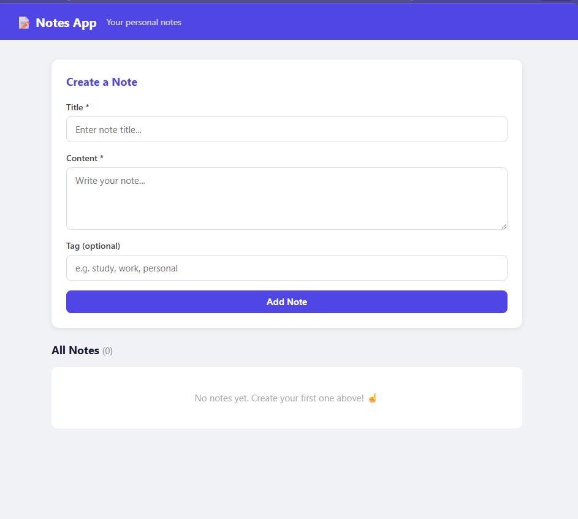

# 📝 Notes API

A full-stack notes application built with FastAPI + Vanilla JS.

## 🛠️ Tech Stack
- **Backend:** Python, FastAPI, Pydantic
- **Frontend:** HTML, CSS, JavaScript
- **API:** REST with JSON

## ✨ Features
- Create notes with title, content, and optional tag
- View all notes in real time
- Delete notes instantly
- Input validation (empty titles rejected)
- Error handling with user-friendly messages

## 🚀 How to Run

### Backend
```bash
cd backend
pip install -r requirements.txt
uvicorn main:app --reload
```
API runs on: http://localhost:8000
Docs at:     http://localhost:8000/docs

### Frontend
Open `frontend/index.html` with Live Server in VS Code.

## 📡 API Endpoints

| Method | Route | Description |
|--------|-------|-------------|
| GET | / | Health check |
| POST | /notes | Create a note |
| GET | /notes | Get all notes |
| GET | /notes/{id} | Get one note |
| PUT | /notes/{id} | Update a note |
| DELETE | /notes/{id} | Delete a note |

## 📸 Screenshot


## 🧠 What I Learned
- Building REST APIs with FastAPI
- Pydantic validation and error handling
- Connecting frontend to backend with fetch()
- CORS and why browsers need it
- HTTP methods and status codes